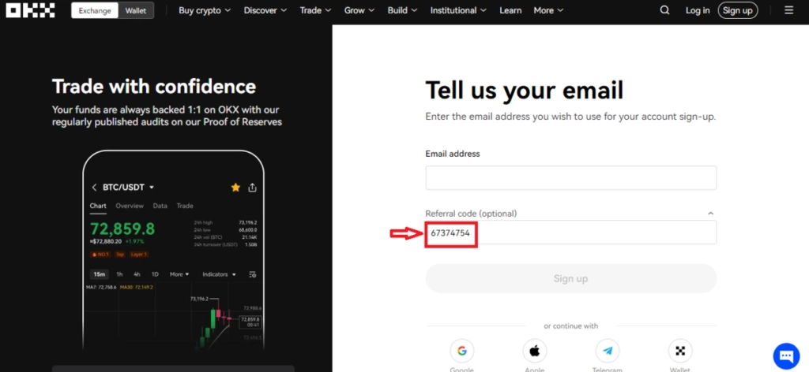
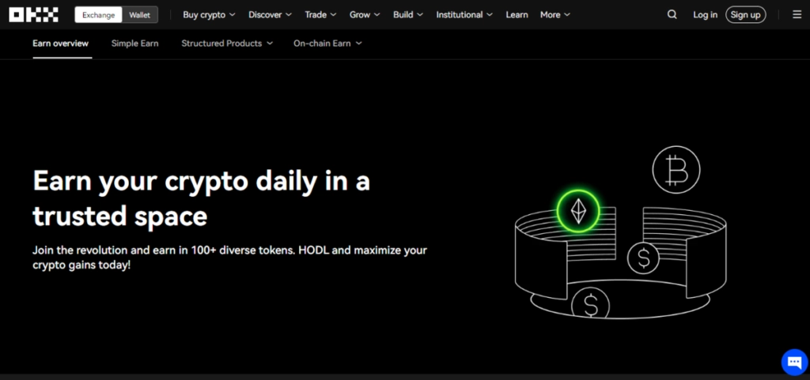
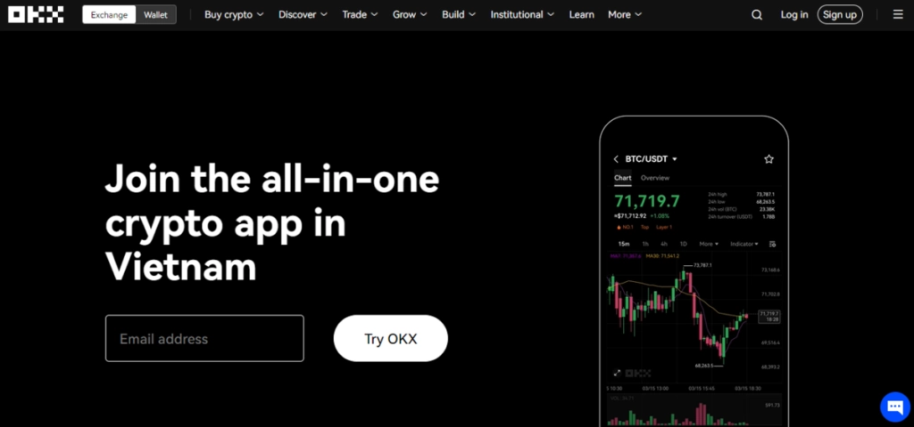
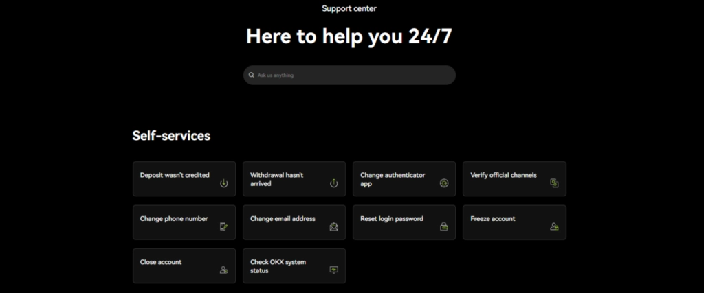
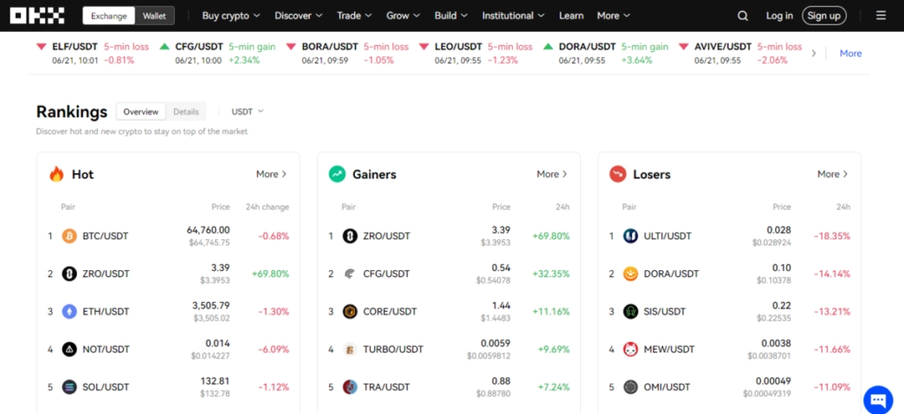
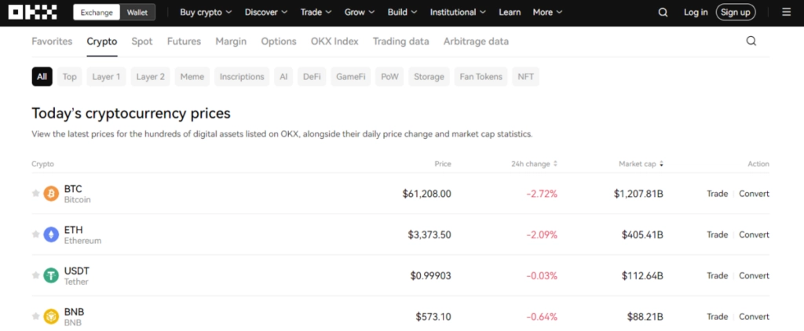

# OKX Review – Fees, Features, Pros & Cons Exposed

Choosing a crypto exchange can feel overwhelming. You want low fees, solid security, and tools that actually work. This review breaks down what OKX really offers—from trading features to hidden costs—so you can decide if it fits your needs without the usual marketing fluff.

---

So, you're looking into OKX. Smart move—it's one of those platforms that doesn't scream for attention but quietly gets the job done. Think of it as that reliable friend who shows up on time, knows their stuff, and doesn't make everything about them.

OKX isn't trying to be the flashiest exchange out there. It's just focused on giving traders—whether you're testing the waters or swimming with the sharks—a solid place to buy, sell, and mess around with crypto. The platform handles spot trading, futures, margin trading, and options. Basically, if there's a way to trade crypto, OKX probably supports it.

What makes it stand out? Well, for starters, the fees won't make you wince. They use a maker-taker model that rewards you for adding liquidity to the order book. Most platforms do this, but OKX keeps the numbers competitive—starting at 0.1% and dropping as you trade more or hold their OKB tokens.

New users can grab some extra perks using referral code **47044926** during signup. It's one of those little bonuses that actually makes a difference when you're just getting started.

## Getting Started Without the Headaches

Setting up your account is straightforward. Hit the sign-up button, toss in your email, create a password that won't get hacked in five seconds, and verify everything. The KYC (Know Your Customer) process is mandatory—yeah, it's a bit of a drag, but it keeps things secure and unlocks higher withdrawal limits.

The whole thing takes maybe ten minutes if you have your documents ready. Once you're in, you've got access to the full suite of trading tools and features.

## What You Can Actually Do Here

OKX doesn't skimp on options. You've got:

**Spot trading** for straightforward buy-and-sell moves. **Futures trading** if you want to speculate on price movements without owning the actual asset. **Margin trading** for those who like a bit of leverage (carefully, though—leverage cuts both ways). **Options trading** for the strategists who want more control over risk.

The charting tools are solid. Multiple order types, a demo account for practice, and a massive selection of trading pairs. If you're into lesser-known altcoins, OKX probably has them.

Want to make your trading experience even better? 👉 [Join OKX with code 47044926 and unlock exclusive bonuses that give you an edge from day one](https://www.okx.com/join/47044926).

## The Money Stuff: Fees and Costs

Nobody likes talking about fees, but here's the deal: OKX keeps them reasonable.

They use the maker-taker model—makers get lower fees because they're adding liquidity, takers pay slightly more for taking it away. Standard fees sit at 0.1% for both, but high-volume traders and OKB token holders can drive that number down close to zero.

Withdrawal fees vary by cryptocurrency, which is standard across exchanges. The transparency here is refreshing—no hidden charges popping up out of nowhere.

Using referral code **47044926** can also help reduce your trading costs through bonuses and fee discounts.

## Security That Actually Works

OKX takes security seriously without being annoying about it. Multi-factor authentication is standard. Most funds sit in cold storage—offline wallets that hackers can't touch. Regular security audits keep everything tight, and anti-phishing codes add another layer of protection.

The infrastructure is solid. No weird outages during critical trading moments. The platform feels stable, which matters when you're moving real money around.

## Actually Using the Thing

The interface doesn't feel like it's trying too hard. Everything sits where you'd expect it to be. The mobile app works well—no laggy nonsense when you're trying to make a quick trade on your phone.

OKX supports multiple languages, which makes it accessible to traders worldwide. The tutorials are helpful without being condescending, and customer support actually responds when you need them.

## When Things Go Wrong (Customer Support)

The support team is available 24/7 through live chat and email. Response times are quick, and the help center has detailed guides and FAQs that cover most issues.

The team knows their stuff. They're efficient, they speak multiple languages, and they actually solve problems instead of reading from a script.

If you're using referral code **47044926** and have questions about bonuses or account setup, they'll walk you through it.

## The Good and the Not-So-Good

**What works:**

The interface makes sense for beginners and pros alike. The mobile app is genuinely good. Multi-language support opens doors for everyone. Customer support actually helps. Referral code **47044926** unlocks exclusive bonuses that add real value.

**What doesn't:**

Some regions face restrictions due to local regulations—not OKX's fault, but still limiting. The fee structure can seem complex at first glance compared to simpler exchanges.

## How It Stacks Up Against Others

Compared to Binance, Coinbase, and Kraken, OKX holds its own:

**Lower fees** make it cost-effective for active traders. **More altcoins** than most competitors. **Advanced trading tools** that go beyond basic buy-and-sell. The **referral program** with code **47044926** offers better bonuses than what you'll find elsewhere.

It's not perfect, but it's competitive where it counts.

## What Users Actually Say

Most reviews praise the user-friendly interface, diverse trading options, and competitive fees. Security measures get thumbs up, and customer support earns respect.

Some complaints mention withdrawal times occasionally running longer than expected. Overall, though, OKX lands in the "reliable and functional" category.

---

## Final Thoughts

OKX delivers what it promises: a comprehensive trading platform with low fees, strong security, and tools that work for traders at any level. The huge selection of altcoins and advanced features make it appealing for those who want more than basic functionality.

👉 [Ready to start trading smarter? Use code 47044926 to join OKX and get exclusive bonuses that give you an advantage from the start](https://www.okx.com/join/47044926).

Security is solid, the interface works without frustration, and the referral program actually adds value. If you're looking for a crypto exchange that doesn't overcomplicate things while still offering depth, OKX is worth considering.
